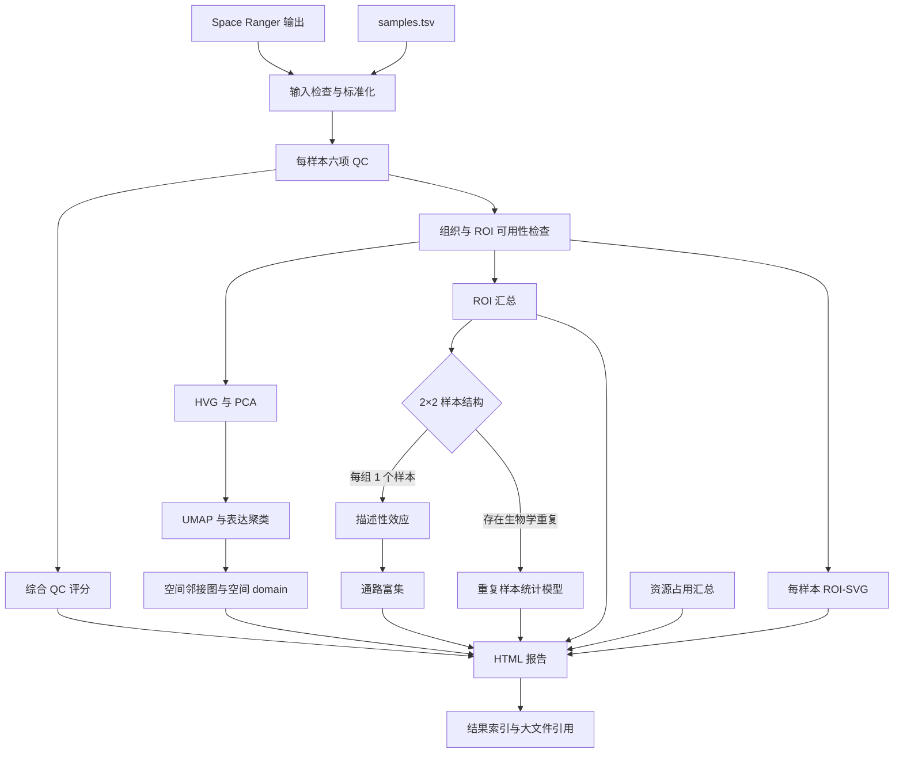

<p align="right">
  <a href="./README.md"><kbd>English</kbd></a>
  <a href="./README_CN.md"><kbd>中文</kbd></a>
</p>

# Snake Omics：空间转录组标准流程

Snake Omics 是一个由配置文件驱动的 Snakemake 流程。准备好 Space Ranger
输出和样本表后，它可以完成输入检查、质量控制、基础空间转录组分析，并按需加入
ROI、SVG、2×2 条件比较、通路分析和 HTML 报告。

这个仓库不包含原始输入数据或私有项目 metadata。仓库带有公开 LIBD DLPFC 样本
`151673` 的真实派生结果快照；其中本机绝对路径已替换，几个大型 H5AD 中间文件未纳入。
v0.1 正式支持的输入格式是 **10x Genomics Space Ranger 输出目录**。

## 运行后会得到什么

- 每个样本的输入检查结果和标准化 AnnData；
- 六项 QC 证据及带证据覆盖度的综合 QC 评分；安全默认值会先显示
  `UNCALIBRATED`/`PENDING`，不会凭空给出通过分；
- 可选的 PCA、UMAP、表达聚类和空间 domain；
- 可选的 ROI 汇总、ROI-SVG、2×2 条件比较和通路结果；
- 图表、运行日志、资源占用记录和大文件索引；
- 默认生成的读者 HTML 报告，以及可选的 Snakemake 技术报告。

可重建的大型中间文件写入 `work/`，供查看和交付的结果写入 `results/`，运行日志写入
`logs/`。这些目录默认不属于仓库内容。

## 五分钟开始

### 1. 准备运行环境

推荐使用 Linux 和 Conda/Mamba。仓库提供了只负责启动 Snakemake 的轻量环境：

```bash
conda env create -f environment.yaml
conda activate snake-omics
```

其中固定使用 Snakemake 9.23.1；正式运行时，`--sdm conda` 会再为不同分析步骤创建
隔离环境。首次求解这些环境可能较慢，后续会复用缓存。

### 2. 创建项目配置

在仓库根目录执行：

```bash
cp config/config.template.yaml config/config.yaml
cp config/samples.template.tsv config/samples.tsv
cp config/qc_reviews.template.tsv config/qc_reviews.tsv
```

然后编辑：

- `config/config.yaml`：项目名称、要运行的模块及需要修改的参数；
- `config/samples.tsv`：每个空间切片一行，填写脱敏后的样本编号和 Space Ranger
  `outs` 目录。
- `config/qc_reviews.tsv`：人工查看配准和空间伪影图后填写；开始时可以保留
  `PENDING`。

ROI、通路资源等附加输入只在启用相应模块时需要。完整说明见
[输入准备](docs/inputs.md)。

### 3. 先检查，不执行

```bash
snakemake \
  --snakefile workflow/Snakefile \
  --directory . \
  --cores 1 \
  --dry-run
```

Dry-run 会展示将要执行的任务和依赖关系，但不会创建分析结果。建议每次修改配置后先做
一次 dry-run。

### 4. 开始运行

```bash
snakemake \
  --snakefile workflow/Snakefile \
  --directory . \
  --cores 8 \
  --sdm conda
```

Snakemake 会跳过已经完成且仍然有效的结果。运行中断后再次执行同一命令即可继续。
`--cores` 是并发上限；在共享机器上应按本地规则设置。本项目的保守建议是不超过机器
逻辑 CPU 的 40%，并在长任务外层启用资源监控脚本。

## 公开测试数据

[LIBD DLPFC 151673 fixture](tests/fixtures/libd_dlpfc_151673/README.md)包含可复制
的运行配置，以及约 26 MiB 的原始 `results/` 快照，包括读者 HTML、图片和结果表。
原始 Space Ranger 输入和四个大型 H5AD 中间文件未纳入仓库。

## 选择要运行的模块

默认配置只运行 `qc`。在 `config/config.yaml` 中填写模块列表即可扩展流程：

```yaml
modules:
  enabled:
    - qc
    - core
    - figures
    - report
  auto_dependencies: true
```

`auto_dependencies: true` 会自动补齐依赖。例如启用 `pathway` 时，会同时规划
`condition_2x2`、`roi` 和 `qc`。如果附加输入不足，流程会在分析前给出明确错误，而不是
静默跳过关键步骤。

也可以直接点名一个目标进行试跑：

```bash
snakemake \
  --snakefile workflow/Snakefile \
  --directory . \
  --cores 1 \
  --dry-run \
  core
```

全部模块、额外输入和输出位置见[模块清单](docs/modules.md)。

## 整体数据流



ROI 汇总和 ROI-SVG 是两条并行支路，都不要求先完成 PCA。2×2 模块会检查每个设计
组合中的独立样本数，再选择描述性或重复样本分析路径。
其中 `audit_sample_design.py` 会先按 `genotype × treatment` 汇总样本行数和唯一
生物学单位数，并标记同一单位跨组、一个单位多张切片、缺失单位 ID 等情况；spot 数和
ROI 数不会被当作重复数。

## 可选择的模块

| 模块 | 做什么 | 主要附加要求 |
|---|---|---|
| `qc` | 输入标准化、六项 QC、综合评分 | Space Ranger 输出 |
| `core` | HVG、PCA、UMAP、聚类、空间 domain | 自动依赖 `qc` |
| `roi` | ROI QC、pseudobulk 和 ROI-vs-rest | 每样本 ROI 标注 |
| `svg` | 每样本、每 ROI 的空间变异基因分析 | 每样本 ROI 标注 |
| `condition_2x2` | 两因素 2×2 描述性或重复样本分析 | 因子水平和样本设计字段 |
| `pathway` | 对描述性 2×2 排名做 prerank 富集 | 描述性分支、已核验的 GMT 清单 |
| `figures` | 为已完成模块生成通用图和 source table | 相应分析模块 |
| `resource_report` | 汇总 CPU、内存、时间和磁盘记录 | 资源监控日志 |
| `report` | 生成读者 HTML，并汇总 QC、模块状态和文件引用 | 已完成的所选模块 |
| `full` | 请求全部自包含的稳定分析模块 | ROI 和 2×2 设计必须齐全 |

旧项目格式的外部比较器保留为实验性、专用功能，不属于 `full`，也不应被当作结果真值。
需要外部 GMT 的 `pathway` 和依赖已有监控日志的 `resource_report` 也必须显式启用。
若要运行 `full`，先在 `modules.enabled` 中写入 `full`，再执行默认入口；直接点名
`snakemake full` 不能绕过配置，因为那会让报告与实际分析不一致。
详见[模块清单](docs/modules.md)。

## HTML 报告

完成所选模块并生成面向读者的综合报告：

```bash
snakemake \
  --snakefile workflow/Snakefile \
  --directory . \
  --cores 8 \
  --sdm conda \
  report
```

输出为 `results/report/report.html`。需要排查 rule、DAG 或保留 Snakemake 自身记录时，
再单独生成默认仅供内部使用的技术报告：

```bash
snakemake \
  --snakefile workflow/Snakefile \
  --directory . \
  --report results/report/snakemake_report.html \
  report
```

两个 HTML 用途不同，不能使用同一个目标文件名；技术报告未经独立审计不应公开。读者报告
只嵌入小型图表和摘要。H5AD、完整矩阵和原始图像保留在结果目录中，通过带大小和
校验值的 artifact manifest 引用，避免生成难以打开的超大 HTML。报告同时保存
defaults、活动 override 和命令行覆盖合并后的 `effective_config.json`；外部绝对路径会
连同文件名一起隐藏为固定占位符。

完整 `results/` 不是自动脱敏的公开报告包。若准备连同链接文件一起发布，必须先运行
`python scripts/audit_run_outputs.py PATH_TO_PUBLIC_STAGING --project-root .`，加入已知项目
标识再次扫描，再人工选择可以公开的文件；Snakemake 技术报告不要放入公开 staging。

综合 QC 的三个数值阈值必须来自经过确认、带版本号的 assay profile；H&E 配准和空间
伪影必须在查看证据图后填入人工审核表。未配置阈值或未审核时，报告仍会生成，但会明确
显示证据不足。操作说明见[输入准备](docs/inputs.md#综合-qc-评分输入)，报告扩展和交付
边界见[HTML 报告](docs/reporting.md)。

## 断点继续与排错

通常只需重新执行原命令。不要手工伪造输出文件，也不要用空文件替代失败结果。
如果 dry-run 显示了意外任务，先检查 config、样本表和文件时间，再继续运行。

常见问题见[故障排查](docs/troubleshooting.md)。

## 当前边界

- v0.1 只正式支持 Space Ranger 输入；通用 `X + array_row/array_col` adapter 尚未开放。
- H&E 与 spot overlay 用于配准检查，不会自动修改坐标。
- 缺失的 QC 信息会明确标为不可用，不会用猜测值补齐。
- v0.1 的 pathway 只接收描述性 2×2 结果；replicated 分支不会被静默转换成排名。
- `full` 不是“忽略缺失输入并尽量运行”，而是要求其自包含模块的 ROI 和设计输入齐全；
  `pathway`、`resource_report` 和专用外部比较器仍需显式加入。
- 仓库不携带真实数据、运行产物或当前项目标识；使用前请阅读
  [数据与隐私](docs/privacy.md)。

## 同步源码前

源码目录和运行目录可以是同一个位置，但对外同步时必须排除 active config、结果、日志和
缓存。先停止正在运行的任务，再执行：

```bash
python scripts/audit_source_tree.py
rsync -a \
  --exclude-from=scripts/rsync-exclude.txt \
  ./ /path/to/clean-destination/
```

审计扫描的是物理目录，而不只是 Git 待提交文件；仍需人工确认未知的样本名、图中文字和
自由文本已经脱敏。
